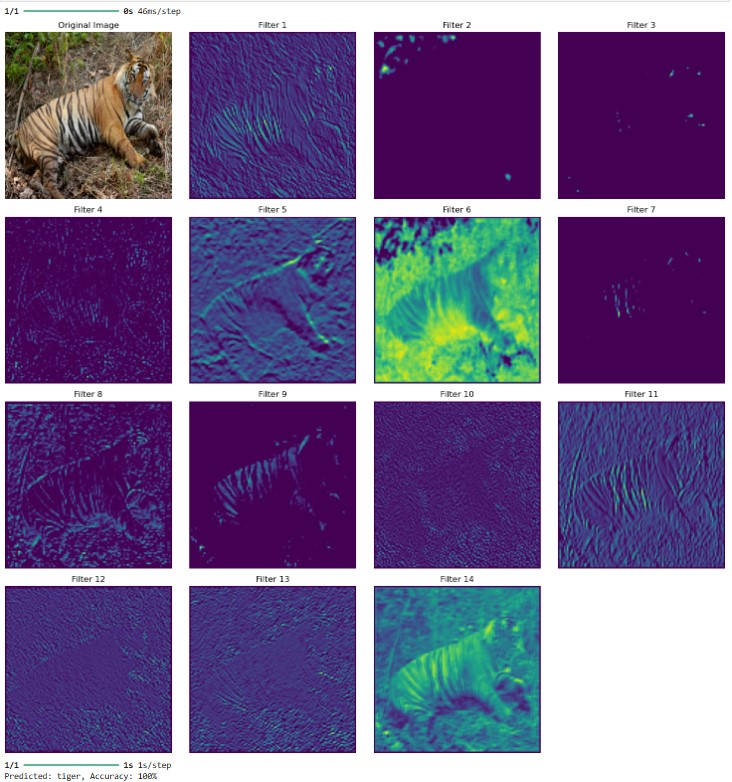
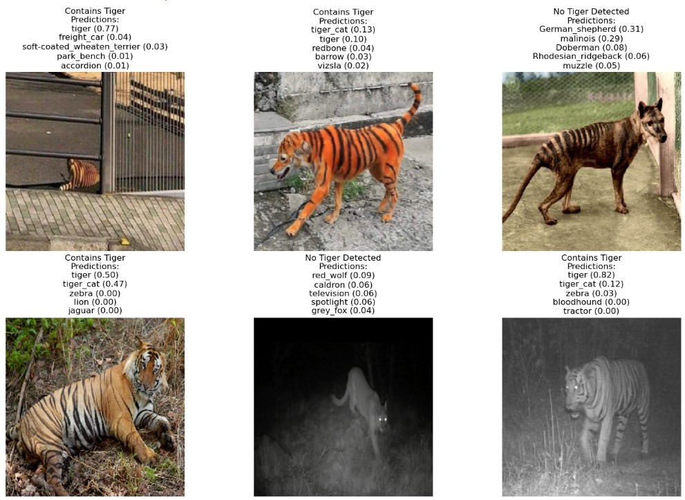
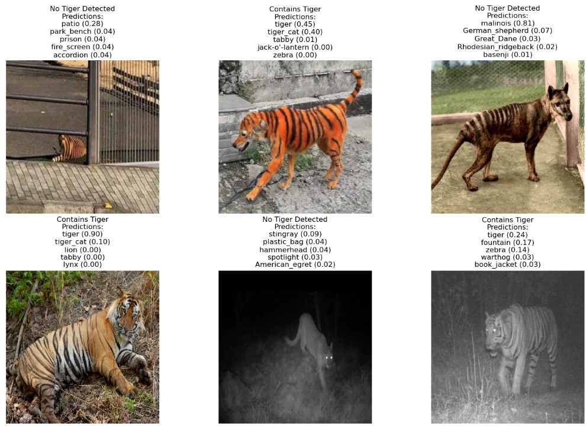

# Convolutional Neural Networks: ResNet50 Image Analysis of a Tiger

## 1. Business Understanding
The goal of this project was to utilize a pre-trained convolutional neural network (CNN) model, specifically ResNet50, to analyze images and visualize the features it extracted. The primary focus was on understanding how different layers of the network perceived the input image, in this case, a tiger. By visualizing the feature maps and making predictions, we aimed to gain insights into the underlying patterns that the model identified as significant, thereby enhancing our understanding of image recognition capabilities.

## 2. Data Understanding
The dataset consisted of images, primarily featuring a tiger. For this project, a single image was utilized to analyze how the ResNet50 model processed it. The input image was resized to 224x224 pixels to match the model's expected input dimensions. Feature maps extracted from various layers of ResNet50 were visualized to observe the characteristics the model focused on, while additional images were analyzed for tiger detection.

## 3. Data Preparation
The image was loaded using Keras utilities, preprocessed to fit the model's requirements, and converted into a format suitable for prediction. This involved:
- Resizing the image to 224x224 pixels.
- Converting the image into an array format.
- Expanding the dimensions to fit the model's input shape.
- Applying necessary preprocessing steps to normalize the data.

## 4. Modeling
The ResNet50 model was loaded with pre-trained weights from ImageNet. The architecture allows for the extraction of feature maps from intermediate layers. Feature maps from a specific layer (e.g., the fifth layer) were extracted for visualization, providing insights into how the model interprets visual information.

### Pros and Cons of ResNet50
**Pros:**
- **Residual Learning**: ResNet50 employs skip connections, which help in training deeper networks by mitigating the vanishing gradient problem.
- **Performance**: It achieves high accuracy on various image recognition tasks and has performed well in competitions like ImageNet.
- **Versatility**: ResNet50 can be fine-tuned for different tasks, making it adaptable for various applications beyond just image classification.

**Cons:**
- **Complexity**: The architecture is more complex than simpler models like VGG16, which can make it harder to interpret.
- **Resource Intensive**: Training and inference can require more computational resources compared to lighter models.
- **Overfitting Risks**: Despite its depth, if not properly regularized, ResNet50 can still overfit on smaller datasets.

## 5. Evaluation
The evaluation phase involved visualizing the feature maps alongside the original image. Each feature map represented different aspects detected by the model, revealing how the network processed visual information. Additionally, we utilized the ResNet50 model to analyze a series of images for tiger detection, examining the model's predictions.

### Predictions and Analysis
1. **Image Loading and Preprocessing**: Six images of animal including but not limited to tigers were loaded and preprocessed to fit the ResNet50 model's input requirements. Each image was resized to 224x224 pixels, converted to an array format, and normalized.

2. **Model Prediction**: The ResNet50 model predicted the contents of each image, returning probabilities for the top five predicted classes.

3. **Decoding Predictions**: The predictions were decoded to extract labels and associated probabilities, allowing us to identify the most likely classes for each image.

4. **Tiger Detection Status**: We checked if the label "tiger" appeared among the top predictions. Images containing the label were marked as "Contains Tiger," while others were labeled "No Tiger Detected."

5. **Visualization**: The results were visualized in a grid layout, displaying each image alongside its predictions and detection status.

### Results

The analysis offered valuable insights into the model's performance, revealing that some images received high-confidence predictions for "tiger," while others were misclassified. For example, an extinct Tasmanian tiger was incorrectly labeled as a German Shepherd or Malinois, and a dog with tiger-like stripes or one lying down with shadows from a fence was misidentified as a tiger. These instances underscored how the ResNet50 model can recognize tigers as well as animals that may visually resemble them, enhancing our understanding of the model's capabilities and its feature extraction process.

## 6. Deployment
Although this project was primarily exploratory, the insights gained from the visualizations could inform future model improvements or applications. The methodology could be expanded to analyze a broader dataset, potentially leading to applications in wildlife conservation, automated species identification, or deeper insights into model interpretability.

## Conclusion
By applying the CRISP-DM methodology, we effectively structured the project to utilize the ResNet50 model for image feature extraction and visualization. The resulting insights and visualizations enhanced our understanding of how CNNs interpret images and identify critical features, paving the way for future research and applications in image recognition tasks.

Links to important files 
[Graphs Folder](Graphs/) 
